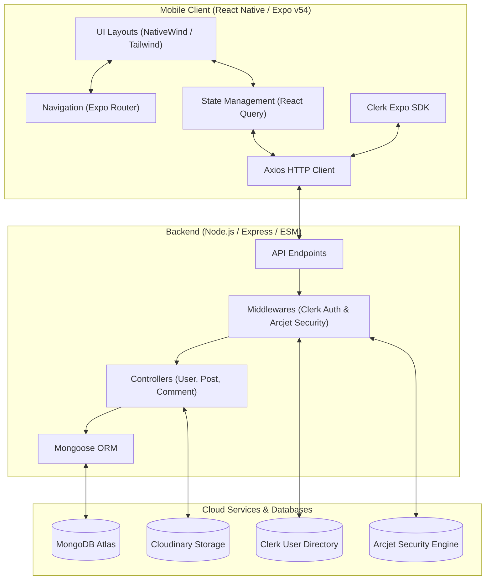
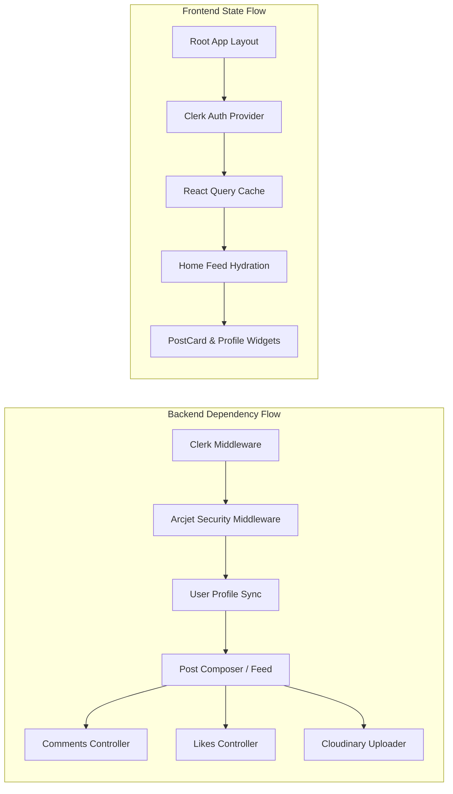

# Threadly - Full-Stack X (Twitter) Clone

A production-grade, full-stack, cross-platform social media platform replicating the core mechanics and design language of X (formerly Twitter). Features secure authentication via Clerk, a real-time chronological home feed, an interactive post composer with Cloudinary image upload, a nested comment system, real-time message rooms, an advanced security middleware suite powered by Arcjet, Mongoose-backed database persistence, custom DNS resolution guards, and a mobile-optimized light-themed interface built using Expo SDK 54 and NativeWind styling.

## Features

### Core Functionality
- **User Authentication**: Secure user registration, login, and session management via Clerk with support for social logins (Google and Apple ID) and email verification.
- **Home Feed / Timeline**: A clean, chronological timeline displaying text and media content from users, utilizing dynamic loading indicators to keep the feed responsive.
- **Tweet/Post Composer**: Seamless post creation interface allowing users to share text content up to 280 characters and attach images directly from their device's camera roll or system gallery.
- **Interactions (Likes & Comments)**: Real-time like toggle and interactive threaded comments modals for engaging in public community discussions.
- **Direct Messaging (DM)**: Real-time chat messaging capabilities allowing users to exchange private messages with long-press deletion functionality for clearing chat histories.
- **User Profiles**: Custom profiles displaying banner images, avatars, bio, location, followers, following, and a user-specific timeline, complete with an interactive Profile Editing modal.

### Advanced Features
- **Expo SDK 54 Integration**: Fully upgraded Native and JS dependencies running React Native 0.81 for seamless integration and compatibility with the physical Expo Go environment.
- **Arcjet Bot Protection & Rate Limiting**: Production-ready security shield protecting API endpoints from SQL injection, XSS, and bot scraping. Configured to run in `DRY_RUN` during local development to facilitate testing from mobile device simulators.
- **Custom DNS Resolution Guard**: Startup configuration forcing Node.js to query Cloudflare/Google public DNS servers (`1.1.1.1` and `8.8.8.8`) to bypass local system and network-level MongoDB Atlas SRV connection blockages.
- **Adaptive Image Dimension Scaling**: Custom styling overrides implementing fixed width/height parameters for all `<Image>` assets across both mobile viewports and web platforms, bypassing React Native Web default resolution inheritance limitations.
- **Safety Profile Hydration Guards**: Bulletproof rendering checks preventing null reference errors (`Cannot read properties of undefined`) during async profile hydration on the Home Feed and Profile screens.
- **Cloudinary Media Engine**: High-performance remote image upload and optimization pipeline that compresses and stores user attachments on the cloud before updating MongoDB.
- **Global Error Interceptors**: Unified Express error-handling middleware that logs call stacks and returns structured JSON error payloads, paired with Axios interceptors on the client side for token injection and error handling.

## Tech Stack

### Backend
- **Node.js** with Express.js
- **TypeScript** / ES Modules for type safety and clean import structures
- **Mongoose ORM** with MongoDB Atlas database
- **Clerk Express SDK** for JWT token verification and session synchronization
- **Arcjet SDK** for bot protection, rate limiting, and exploit shield
- **Cloudinary SDK** for media uploads and remote hosting
- **dotenv** for local environment variables
- **dns** for public DNS server override configurations

### Frontend
- **React Native** & **Expo SDK 54** (Expo Router v6)
- **TypeScript** for consistent compile-time type checking
- **NativeWind (Tailwind CSS v4)** for styled cross-platform UI components
- **TanStack React Query v5** for caching, automatic refetching, and state management
- **Axios** for HTTP request intercepting and API client calls
- **Expo Image Picker** for camera and gallery media extraction
- **Ionicons & Feather Icons** for visual iconography matching the X/Twitter brand guidelines

## System Architecture

The application is structured as a full-stack client-server architecture with secure cloud integrations.



## Module Dependency

The backend modules operate around user validation and secure database transactions, while the client components manage state hydration.



## Project Structure

```
x-clone-rn-master/
├── backend/                # Backend Application (Node.js/Express)
│   ├── src/
│   │   ├── config/         # Database, Cloudinary, Arcjet, and Env configurations
│   │   ├── controllers/    # API controllers (user, post, comment, notification)
│   │   ├── middleware/     # Auth checks, error handling, and Arcjet security
│   │   ├── models/         # Mongoose schemas (User, Post, Comment, Notification)
│   │   ├── routes/         # Express API router configurations
│   │   ├── scripts/        # Seed scripts (seed.js for database populating)
│   │   └── server.js       # App entry point with custom DNS server configuration
│   ├── .env.example
│   └── package.json
├── mobile/                 # Frontend Mobile Client (React Native/Expo)
│   ├── app/                # Expo Router views and Tabs layouts
│   │   ├── (auth)/         # Auth views (Login, Sign-up)
│   │   ├── (tabs)/         # Bottom navigation screen tabs (Home, Search, Messages, Profile)
│   │   └── _layout.tsx     # Application root provider layout (Clerk, React Query)
│   ├── components/         # Shared UI components (PostCard, PostComposer, modals)
│   ├── hooks/              # Custom React hooks (useCurrentUser, useUserSync)
│   ├── utils/              # Axios API configurations and helper formatters
│   ├── tsconfig.json       # Expo compiler TypeScript configurations
│   ├── .env.example
│   └── package.json
└── README.md
```

## API Documentation Overview

The backend exposes the following RESTful API endpoints:

### Authentication & User Sync
*   **POST** `/api/users/sync` - Syncs Clerk authenticated user details to MongoDB (resolves names, emails, avatars).
*   **GET** `/api/users/me` - Retrieves current logged-in user profile from database.
*   **PUT** `/api/users/profile` - Updates bio, location, avatar, and banner credentials.
*   **GET** `/api/users/profile/:username` - Public route to fetch a user's details by username.
*   **POST** `/api/users/follow/:targetUserId` - Toggles follow/unfollow states between users.

### Posts (Tweets)
*   **GET** `/api/posts` - Fetches the global chronological feed populated with user metadata and comments.
*   **POST** `/api/posts` - Creates a new tweet (accepts text content and optional Cloudinary media payload).
*   **GET** `/api/posts/user/:username` - Fetches all tweets belonging to a specific user.
*   **POST** `/api/posts/:postId/like` - Toggles like/unlike state for a tweet.
*   **DELETE** `/api/posts/:postId` - Removes a tweet from the database (only allowed by the creator).

### Comments
*   **POST** `/api/comments/post/:postId` - Submits a comment on a post.

### Notifications
*   **GET** `/api/notifications` - Fetches alerts (likes, comments, follows) linked to the user's posts.
*   **DELETE** `/api/notifications/:id` - Dismisses a specific notification.

## Performance & Safety Highlights

### Custom DNS Resolution Fallback
To solve common Node.js `querySrv ECONNREFUSED` errors when running MongoDB Atlas connections under restricted DNS setups on Windows:
```javascript
import dns from "node:dns";
dns.setServers(["1.1.1.1", "8.8.8.8"]);
```
*Forces standard queries directly through Cloudflare and Google public resolvers, guaranteeing consistent database access.*

### Optional Chaining for Rendering Safety
All visual components use explicit optional chaining when referencing nested user objects (e.g. `post.user?.username`) to avoid layout crashes during initial feed loads when Clerk state is still initializing:
```typescript
const isOwnPost = post.user?._id === currentUser?._id;
```

### Web Styling Dimension Corrections
Standard React Native `Image` components fail to inherit Tailwind utility sizing on React Native Web. All images include explicit style overrides to ensure proper dimension scaling across all platforms:
```typescript
style={{ width: 48, height: 48 }}
```